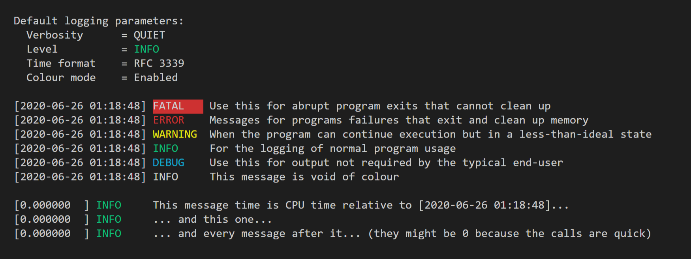

# libgroot

libgroot is a lightweight logging library suitable for quick implementation into any C project.

## Features
- Output to a log file or stdout
- Limit output to specific logging levels
- Optional colour-coding
- Optional time output
- CPU-time mode

## Installation
From the program's root directory, `make` compiles the `libgroot.so` shared object.

For use with programs, refer to the following example:

### Example
Consider the project root as `libgroot` and the library is being used by `foo.c`:

1. Use `#include "log.h"` in `foo.c`
2. Compile with the necessary include path; link with the correct dynamic library linkage; and run:
    ```
    ~$ gcc -c foo.c -Ilibgroot/include -o foo.o

    ~$ gcc foo.o -Llibgroot -Wl,-rpath=libgroot -lgroot -o foo

    ~$ ./foo
    ```

## Usage
Off the bat the library is ready to be used without configuration. Just use this simple command and specify the log level and message:

```C
logMessage(WARNING, "This log message will warn the user");
```

### Parameters

| Parameter      | Usage |
|:---------------|:------|
| Log file       | Initialise with `openLog("path/to/file")` and it will append messages to the file. Close with `closeLog()` |
| Verbosity      | To output the log to stdout (can work alongisde a file, too), set verbosity with `setLogVerbosity(true)`. Similarly, to disable it, set to `false` |
| Logging level  | To have the library ignore messages below a specified level, use `setLogLevel(level)`, where `level` is any of the aforementioned severities |
| Time format    | `setLogTimeFormat(format)`, where `format` can be `LOG_TIME_NONE` for no output, `LOG_TIME_RFC3339` for `[YYYY-MM-DD hh:mm:ss]`, and `LOG_TIME_RELATIVE` for the elapsed CPU time after a `setLogReferenceTime()` call |
| Log start time | At any point `setLogStartTime()` can be called (which can later be retrieved with `getLogStartTime()`) to store the current time for whatever reason |
| Colour mode    | Colouring of the severity levels can be disabled with `setLogColourMode(false)` (and, similarly, re-enabled with `true`)

### Demonstration
Look in [test/log_demo.c](test/log_demo.c) for a practical use of the library and a subset of its functions. Run `make demo` from the project's root to compile the demonstration script, and run with `./log_demo`:

